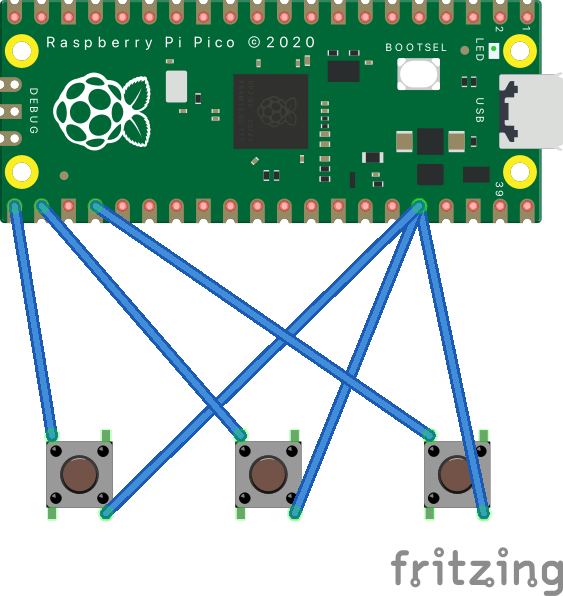

# WebEx Streamdeck
A home built streamdeck for WebEx meetings. Allows for muting and unmuting the microphone, showing and hiding the camera and showing and hiding the chat window.

# Required Parts

* Raspberry Pi Pico
* Tactile Switches x3
* Wire
* Micro USB to USB A cable (or to USB C)

# Wiring it up

# WebEx Shortcuts

# Code

The code is written to use Circuit Python.

Copy the code from [code.py](./code/code.py) onto the board.